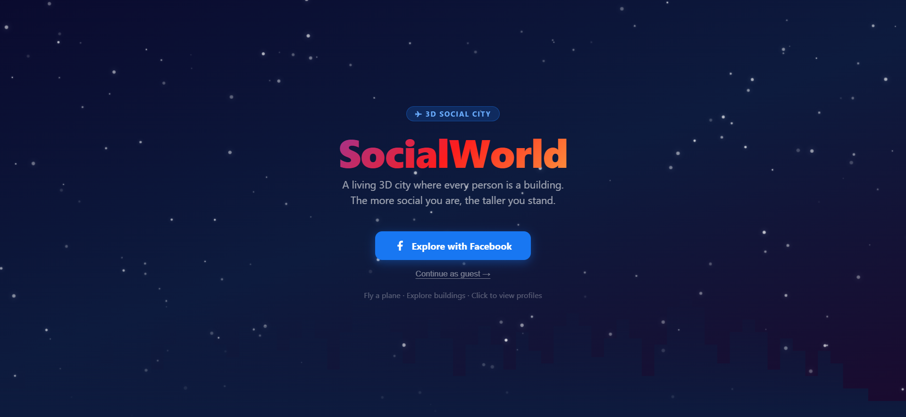
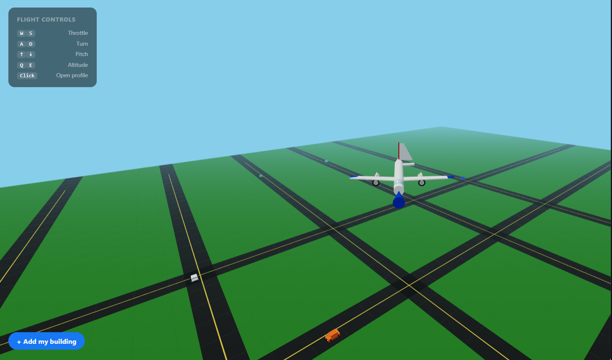
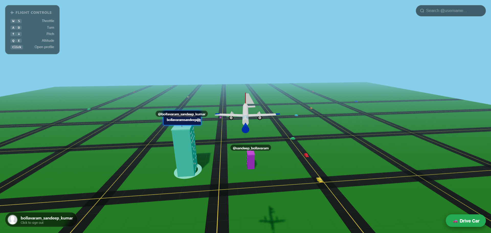
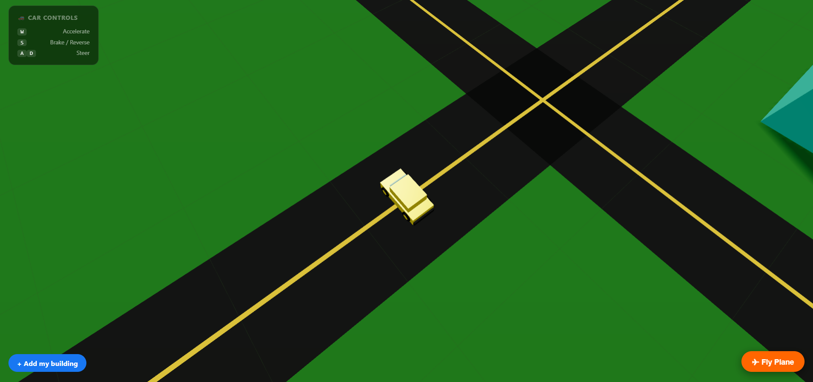

# 🌆 SocialWorld

> **A living 3D city where every Facebook user is a building.**
> Fly a plane, drive a car, explore the skyline — every building is a real person.



---

## 📸 Screenshots

| Landing Page | 3D City View |
|---|---|
|  |  |

| Plane Flying | Car Driving |
|---|---|
|  |  |

| Building Profile Panel | Ad Billboards |
|---|---|
|  |  |

---

## ✨ Features

- 🏙️ **Living 3D city** — every logged-in user becomes a permanent building
- 📏 **Height = followers** — taller buildings = more social clout
- ✈️ **Fly a jet plane** — full keyboard flight controls
- 🚗 **Drive a car** — switch to car mode and cruise the roads
- 👆 **Click buildings** — slide-in profile panel with stats and posts
- 🔍 **Search** — fly the camera to any user's building instantly
- 👥 **Guest mode** — explore the city without logging in
- 📢 **Ad billboards** — on buildings across the city
- 🌨️ **Animated landing page** — snow particles + city silhouette
- 📡 **Offline detection** — automatic disconnected page
- 🏛️ **Permanent buildings** — stay in the world forever even when offline

---

## 🎮 Controls

### ✈ Plane
| Key | Action |
|-----|--------|
| `W` | Increase throttle |
| `S` | Decrease throttle |
| `A` / `D` | Turn left / right |
| `↑` / `↓` | Pitch nose up / down |
| `Q` / `E` | Ascend / Descend |
| `Click` | Open building profile |

### 🚗 Car
| Key | Action |
|-----|--------|
| `W` | Accelerate |
| `S` | Brake / Reverse |
| `A` / `D` | Steer left / right |

---

## 🛠️ Tech Stack

| Layer | Technology |
|-------|-----------|
| Frontend | React 18 + Vite 6 + Three.js 0.161 |
| 3D Engine | Three.js — WebGL, CSS2DRenderer |
| Backend | Node.js + Express (ESM) |
| Database | Supabase (PostgreSQL) |
| Auth | Facebook Login (OAuth 2.0) + JWT |
| Hosting | Vercel (frontend) + Render.com (backend) |

---

## 📁 Project Structure

```
SocialWorld/
├── client/                        # React + Vite frontend
│   ├── public/
│   │   └── favicon.svg
│   ├── src/
│   │   ├── World.js               # Three.js 3D engine (plane, cars, buildings)
│   │   ├── api.js                 # Backend API + Facebook OAuth
│   │   ├── App.jsx                # Root component + auth state machine
│   │   ├── index.css              # All styles
│   │   └── components/
│   │       ├── FlightHints.jsx    # Controls legend (plane + car)
│   │       ├── SearchBar.jsx      # Username search
│   │       └── SidePanel.jsx      # Building profile slide-in
│   ├── .env.example
│   ├── index.html
│   └── vite.config.js
│
├── server/                        # Node + Express backend
│   ├── routes/
│   │   ├── auth.js                # POST /api/auth/facebook + GET /api/auth/callback
│   │   ├── buildings.js           # GET /api/buildings (public)
│   │   └── user.js                # GET /api/user/:username
│   ├── db/
│   │   ├── supabase.js            # Supabase client + all DB queries
│   │   └── migration.sql          # Run once in Supabase SQL Editor
│   ├── facebookAuth.js            # Facebook Graph API helpers
│   ├── env.js                     # Loads dotenv first (ESM fix)
│   ├── server.js                  # Express entry point
│   └── .env.example
│
└── docs/
    └── images/                    # 📸 Add your demo screenshots here
        ├── banner.png
        ├── landing.png
        ├── city.png
        ├── plane.png
        ├── car.png
        ├── panel.png
        └── billboard.png
```

---

## 🚀 Setup Guide

### 1. Facebook Developer App

1. Go to **https://developers.facebook.com** → **My Apps → Create App**
2. Enter app name, click **Next**
3. On Use Cases → select **"Authenticate and request data from users with Facebook Login"** → Next
4. Complete the app creation wizard
5. Go to **Use Cases → Customize** on Facebook Login → **Settings**
6. Add `http://localhost:3001/api/auth/callback` to **Valid OAuth Redirect URIs** → Save
7. Go to **App Settings → Basic** → copy **App ID** and **App Secret**

### 2. Supabase Database

1. Create a free project at **https://supabase.com**
2. Go to **SQL Editor** and run:

```sql
create extension if not exists "uuid-ossp";

create table if not exists public.users (
  id                   uuid primary key default uuid_generate_v4(),
  instagram_id         text unique not null,
  username             text not null,
  follower_count       integer not null default 0,
  profile_picture_url  text not null default '',
  building_position_x  float not null default 0,
  building_position_z  float not null default 0,
  created_at           timestamptz not null default now()
);

create index if not exists users_username_idx on public.users (lower(username));
create index if not exists users_position_idx on public.users (building_position_x, building_position_z);

alter table public.users enable row level security;

create policy "Public read" on public.users for select using (true);
create policy "Backend insert" on public.users for insert with check (true);
create policy "Backend update" on public.users for update using (true) with check (true);

grant usage on schema public to anon;
grant select, insert, update on public.users to anon;
```

3. Go to **Settings → API** → copy **Project URL** and **anon key**

### 3. Local Development

```bash
# Clone the repo
git clone https://github.com/YOUR_USERNAME/SocialWorld.git
cd SocialWorld

# Backend
cd server
npm install
cp .env.example .env
# Fill in your values in .env
npm run dev

# Frontend (new terminal)
cd client
npm install
cp .env.example .env
# Fill in your values in .env
npm run dev
```

Open **http://localhost:5173** 🎉

### 4. Environment Variables

**`server/.env`**
```env
FACEBOOK_APP_ID=your_facebook_app_id
FACEBOOK_APP_SECRET=your_facebook_app_secret
FACEBOOK_REDIRECT_URI=http://localhost:3001/api/auth/callback

SUPABASE_URL=https://your-project.supabase.co
SUPABASE_KEY=your_supabase_anon_key

JWT_SECRET=any_long_random_string_32_chars_min

CLIENT_URL=http://localhost:5173
PORT=3001
```

**`client/.env`**
```env
VITE_API_URL=http://localhost:3001
VITE_FACEBOOK_APP_ID=your_facebook_app_id
VITE_FACEBOOK_REDIRECT_URI=http://localhost:3001/api/auth/callback
```

---

## ☁️ Production Deployment

### Backend → Render.com
1. Push repo to GitHub
2. Create new **Web Service** on Render → set root to `server/`
3. Build command: `npm install` | Start: `node server.js`
4. Add all `server/.env` vars in Render dashboard
5. Update `FACEBOOK_REDIRECT_URI` and `CLIENT_URL` to production URLs

### Frontend → Vercel
1. Import repo in Vercel → set **Root Directory** to `client`
2. Framework: **Vite**
3. Add all `VITE_*` env vars with production values
4. Deploy ✅

---

## 📢 Advertise

Want your ad on a SocialWorld billboard?
📧 **bollavaramsandeep@gmail.com**

---

## 📜 License

MIT — free to use, modify, and deploy.

---

*Built with ❤️ using React, Three.js, Node.js, Supabase, and Facebook Login*
